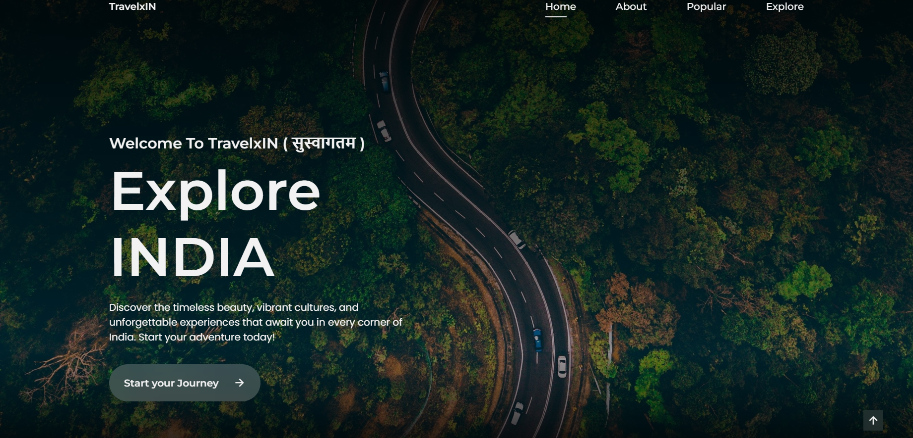

# TravelxIN

Welcome to TravelxIN, your ultimate guide to exploring the diverse and vibrant landscapes of India. This landing page is designed to inspire and guide travelers, showcasing the beauty and culture of India through stunning visuals and informative content.



## Demo

You can view the landing page online [here](https://travelx-in.vercel.app/).

## Getting Started

To run the landing page locally, follow these steps:

1. Clone this repository:
    ```bash
    git clone https://github.com/its-jhaanuj-21/TravelxIN.git
    ```

2. Navigate to the project directory:
    ```bash
    cd TravelxIN
    ```

3. Open `index.html` in your web browser.

## Features

- **Responsive Design**: Ensures the website looks great on all devices.
- **Beautiful Imagery**: Stunning images of popular Indian destinations.
- **Informative Sections**: Sections highlighting the beauty and diversity of India.
- **Interactive Elements**: Hover effects and interactive components for a better user experience.

## Technologies Used

- HTML5
- CSS3
- JavaScript

## How to Use

1. Open `index.html` in a web browser to view the landing page.
2. Explore the various sections to see images and descriptions of popular Indian destinations.
3. Interact with the page to experience the hover effects and other interactive elements.

## Contributing

Contributions are welcome! If you have any suggestions, improvements, or bug fixes, feel free to open an issue or create a pull request.

---

**TravelxIN - Your gateway to exploring the soul of India. 🇮🇳**
